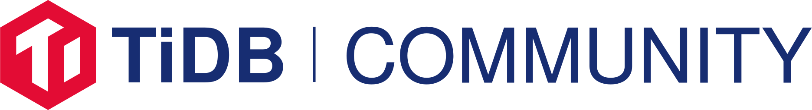

# TiDB Community

Welcome to the TiDB Community! The main objective is to help members of the
TiDB community who share similar interests to learn from and collaborate with
each other.

Your journey of becoming a contributor and committer starts from here:
improving docs, improving code, giving talks, organizing meetups, etc.

## Architecture

## TiDB User Group

The TiDB User Groups (TUGs) are groups for facilitating communication and
discovery of information related to topics that have long term relevance to
large groups of TiDB users.

See [docs](https://pingcap.com/docs/) or
[docs-cn](https://pingcap.com/docs-cn/) for user documents. Also you can get
help in [AskTUG](https://asktug.com/) if you met any problem.

## TiDB Developer Group

### Communication

The [communication](./communicating.md) page lists communication channels like
chat, social medias, etc.

For more specific topics, join
[https://pingcap.com/tidbslack](https://pingcap.com/tidbslack) and discuss with others.

### Governance

TiDB has the following types of groups that are officially supported:

* **Special Interest Groups (SIGs)** are persistent open groups that focus on a
  module of TiDB. SIGs must have open and transparent proceedings. Anyone is
  welcome to participate and contribute provided they follow the TiDB [Code of
  Conduct](./CODE_OF_CONDUCT.md). The purpose of a SIG is to own and develop a
  module of TiDB.

* **Working Groups (WGs)** are temporary groups that are formed to address
  issues that cross SIG boundaries. Working groups do not own any code or other
  long term artifacts. Working groups can report back and act through involved
  SIGs.

### How to contribute

Contributions are welcomed and greatly appreciated. See [How to
contribute](./contributors/README.md) for details on setting up development
environment, contribution workflow and submitting patches, etc.

## Learning Resources

Learning resources are collected in the [learning
resources](./learning-resources/README.md) page. Here you can find all the
resources which helps you learn and contribute TiDB. For example, you can learn
TiDB architecture though the following blogs:

* How we build TiDB: [English](https://www.pingcap.com/blog/2016-10-17-how-we-build-tidb/), [Chinese](https://pingcap.com/blog-cn/how-do-we-build-tidb/)
* TiDB Internal (I) - Data Storage: [English](https://pingcap.com/blog/2017-07-11-tidbinternal1/), [Chinese](https://pingcap.com/blog-cn/tidb-internal-1/)
* TiDB Internal (II) - Computing: [English](https://pingcap.com/blog/2017-07-11-tidbinternal2/), [Chinese](https://pingcap.com/blog-cn/tidb-internal-2/)
* TiDB Internal (III) - Scheduling: [English](https://pingcap.com/blog/2017-07-20-tidbinternal3/), [Chinese](https://pingcap.com/blog-cn/tidb-internal-3/)

## TiDB Roadmap

See [TiDB Roadmap](https://pingcap.com/docs/v2.1/roadmap/#tidb-roadmap).

## Community Activities

* [Infra Meetup](https://github.com/pingcap/presentations/tree/master/Infra-Meetup)
* [Hackathon 2019](https://github.com/pingcap/presentations/tree/master/hackathon-2019)
* [Techday 2019](https://github.com/pingcap/presentations/tree/master/techday2019)
* [Paper Reading](https://github.com/pingcap/presentations/blob/master/paper-reading.md)
* [Summer of code](./soc/README.md)
* [Performance Challenge Program](./challenge-Programs/README.md)
* [PingCAP Talent Plan](https://github.com/pingcap/talent-plan)

## License

TiDB Community is under the Apache 2.0 license. See the
[LICENSE](./LICENSE.md) file for details.

## Acknowledgements

Thank you to the [Kubernetes](https://github.com/kubernetes/community),
[Apache](http://activemq.apache.org/becoming-a-committer.html) and
[Docker](https://github.com/docker/community) community pages for providing us
with inspirations.
