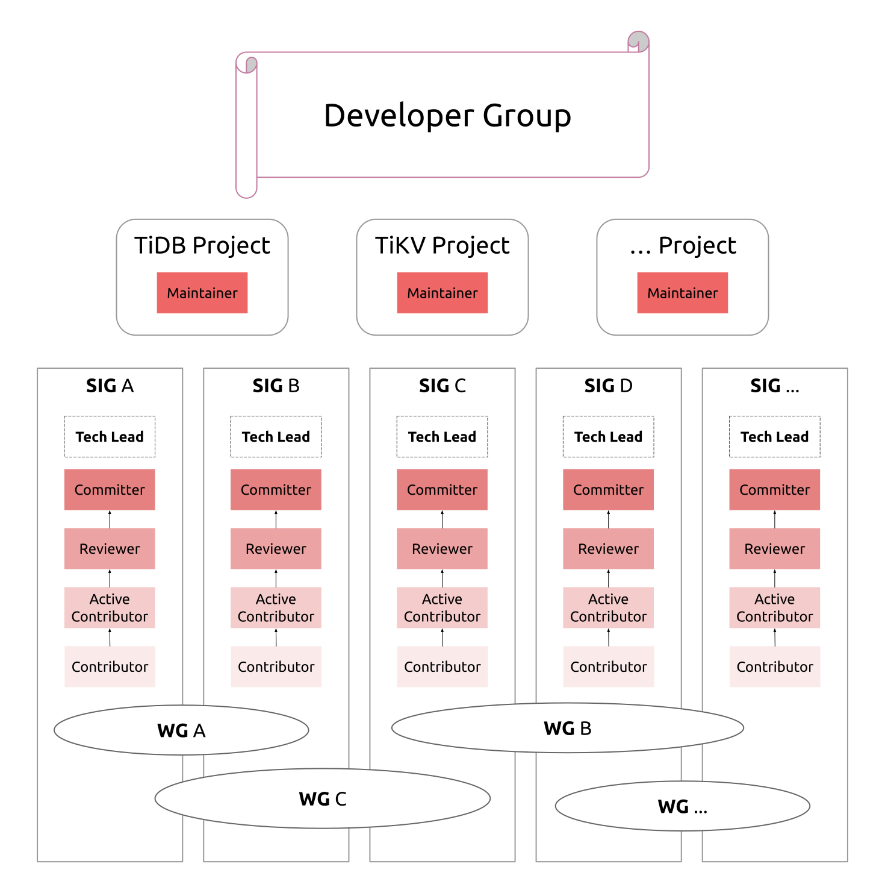

# TiDB Community Architecture

Open source projects live and breathe the open source community with different
types of roles. The TiDB community has the following organizations:

## Content

<!-- vim-markdown-toc GFM -->

* [PMC](#pmc)
* [TiDB Developer Group](#tidb-developer-group)
    * [Contributor](#contributor)
        * [How to become a Contributor?](#how-to-become-a-contributor)
        * [Contributor List](#contributor-list)
    * [Active Contributor](#active-contributor)
    * [Reviewer](#reviewer)
        * [How to become a Reviewer?](#how-to-become-a-reviewer)
        * [Responsibilities and Privileges](#responsibilities-and-privileges)
    * [Committer](#committer)
        * [How to become a Committer?](#how-to-become-a-committer)
        * [Responsibilities and Privileges](#responsibilities-and-privileges-1)
        * [Definition of Inactive Committer and operations:](#definition-of-inactive-committer-and-operations)
        * [Committer List](#committer-list)
    * [Maintainer](#maintainer)
        * [How to become a Maintainer?](#how-to-become-a-maintainer)
        * [Responsibilities and Privileges](#responsibilities-and-privileges-2)
* [TiDB User Group](#tidb-user-group)
* [Organizer Committee](#organizer-committee)

<!-- vim-markdown-toc -->

## PMC

TBD

## TiDB Developer Group

### Contributor

A Contributor refers to the person who contributes to the following projects:

* TiDB: https://github.com/pingcap/tidb
* Parser: https://github.com/pingcap/parser
* TiKV: https://github.com/tikv/tikv
* TiSpark: https://github.com/pingcap/tispark
* PD: https://github.com/pingcap/pd
* Docs: https://github.com/pingcap/docs
* Docs-cn: https://github.com/pingcap/docs-cn

#### How to become a Contributor?

If a PR (Pull Request) submitted to any one of the above projects by you is
approved and merged, then you become a Contributor.

You are also encouraged to participate in the projects in the following ways:

* Actively answer technical questions asked by community users in github issues.
* Help test the projects.
* Help review the pull requests (PRs) submitted by others.
* Help improve technical documents.
* Submit valuable issues.
* Report or fix known and unknown bugs.
* Participate in the existing discussion about features in the roadmap, and
  have interest in implementing a certain feature independently.
* Write articles about source code analysis and usage cases for the
  projects.

#### Contributor List

[TiDB Contributors](./contributor-list.md)

### Active Contributor

TBD

### Reviewer

Reviewers are able to review code for quality and correctness on some part of a
subproject. They are knowledgeable about both the codebase and software
engineering principles.

#### How to become a Reviewer?

* Knowledgeable about the codebase
* Sponsored by 2 Committers
* Merged at least 20 PRs 

#### Responsibilities and Privileges

* Responsible for project quality control
    * Focus on code quality and correctness, including testing and factoring

    * May also review for more holistic issues
* Expected to be responsive to review PR on time
* Assigned test and fix bugs in subproject 
* Have the rights to approve PR
* Participate in the future seminar

### Committer

Committers are developers of the projects and are elected from contributors.
Currently.

#### How to become a Committer?

A new Committer must be nominated by any existing Maintainer or PMC member, and
is generated through the voting of PMC members.

A Committer must have accomplished one or more of the following items:

* Your commits have been approved and merged by Maintainers for over ten times.
* You have implemented a complete feature.
* You have fixed a vital bug.

#### Responsibilities and Privileges

* Recommend a new Organizer Committee Member
* The profile can be listed on the Committer page
* Participate in offline discussions and the design process

#### Definition of Inactive Committer and operations:

If a Committer has been inactive for over three months, the Committer is an
Inactive Committer.  Concrete inactive behaviors are as follows:

* Absent from any community activity for over three months
* Absent from any Committer meeting for over three months
* Absent from technical discussions
* No code commits (including documentation) for over three months

If a Committer has not committed any code for over a year, then the Committer
privileges are reclaimed.

#### Committer List

[Committer List](./committer-list.md)

### Maintainer

TBD

#### How to become a Maintainer?

TBD

#### Responsibilities and Privileges

TBD

## TiDB User Group

The TiDB User Groups (TUGs) are groups for facilitating communication and
discovery of information related to topics that have long term relevance to
large groups of TiDB users.

## Organizer Committee

TBD
