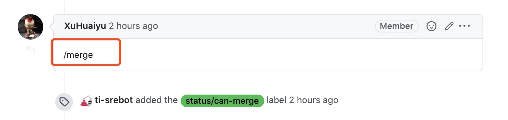
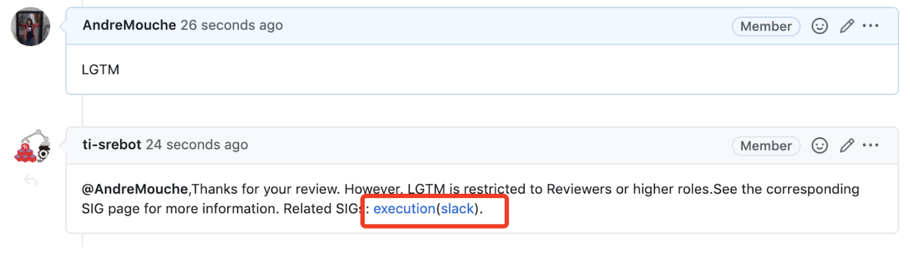
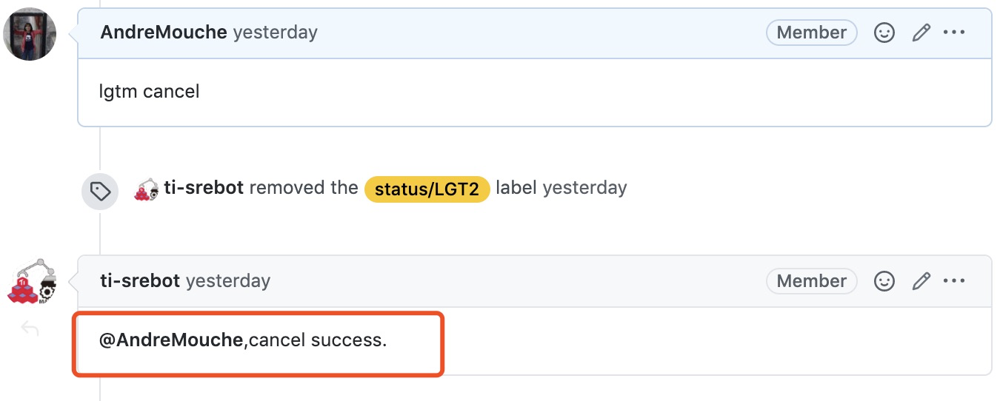
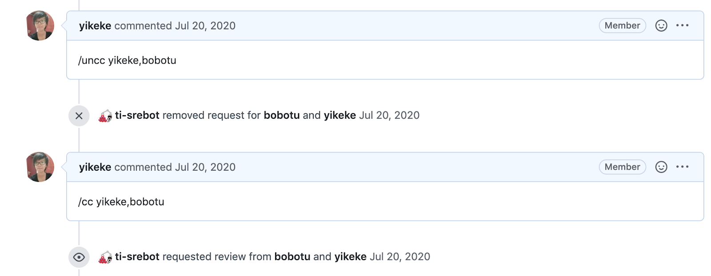
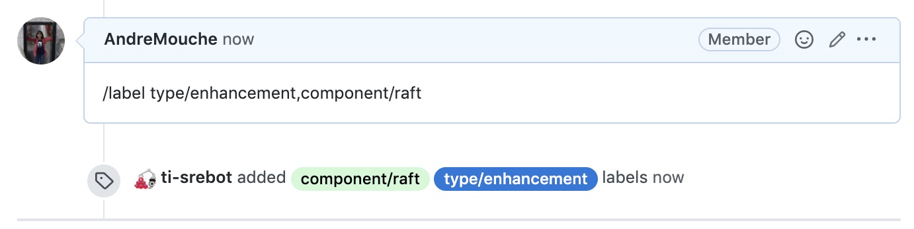
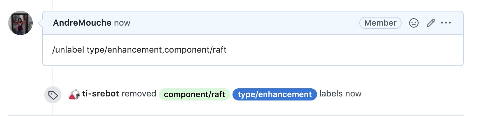

# 
| Command        | Explanation                                                  | Authority               |
| -------------- | ------------------------------------------------------------ | ----------------------- |
| /merge         | Once the merging conditions are met, GitHub automatically runs the test and merges the PR after that. By default, at least 2 LGTMs are required to merge the PR.  Each SIG can choose to modify this number according to their needs. The */merge* action will also check how many LGTMs are required to merge the current PR. The checking sequence is as follows:  1. If the PR contains the label of ‘require-LGT3’, check whether  the number of LGTMs is greater than or equal to 3.   2. If the above condition is not met, then check the default label defined by SIG | SIG Committer or higher |
| LGTM           | Short for ‘look good to me’. The bot automatically replies ‘approve’ to the PR if the number of LGTMs is sufficient. | SIG reviewer or higher  |
| LGTM  cancel   | Cancel LGTM                                                  | SIG reviewer or higher  |
| /cc            | Request PR reviewers (separated by comma)                    | anyone                  |
| /uncc          | Cancel requesting PR reviewers                               | anyone                  |
| /label         | Assign labels to the issue/PR  (separated by comma)          | anyone                  |
| /unlabel       | Remove labels from the issue/PR                              | anyone                  |
| /assign        | Assign issue/PR to yourself                                  | anyone                  |
| /assign cancel | Cancel assigning to yourself                                 | anyone                  |

# For example:
## /merge

## LGTM 

LGTM failed：

## LGTM cancel

## /cc

## /label

## /unlabel

