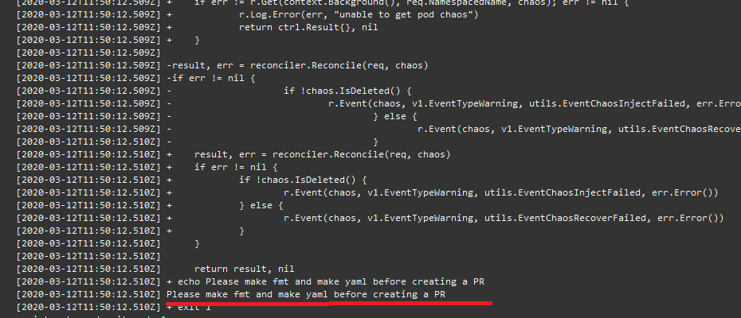
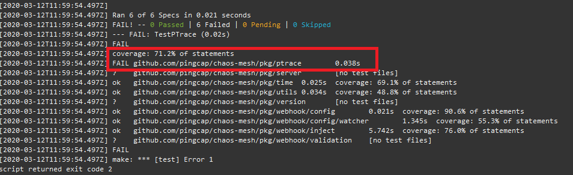
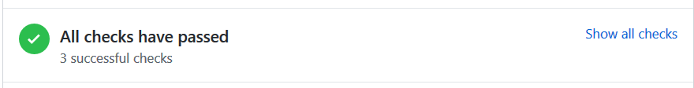

## 常见 CI 错误

每一个提交给 chaos-mesh 的 pull request 都需要经过 CI 环境的检查。目前 chaos-mesh 的 ci 主要验证以下两点:

* 是否已经格式化代码、更新并生成yaml文件
* 是否能通过单元测试

如果你的 CI 没有通过，点进详细信息（如下图), 接下来我们将描述几个常见的 CI 错误

### 代码未经过格式化

在 CI 过程中，会去检查代码是否经过格式化，如果在错误信息中出现下图场景，那么意味着你需要进行代码格式化以及更新 yaml 文件。

你可以通过在项目根目录下执行以下两个命令来格式化代码以及更新 yaml 文件:

> `make fmt`

> `make yaml`

### 未通过单元测试

如果在 CI 测试环节中发现是单元测试没有通过，可以通过以下步骤来进行检查:

1. 在项目根目录执行本地测试命令来验证是否新改动的代码引起测试失败:

> `make test`

如果测试没有通过，则需要修复代码来通过测试。如果测试通过，则继续往下进行。

2. 遭遇了不稳定的测试

目前 chaos-mesh 的单元测试中， ptrace 相关测试并不稳定。可以通过在 pull request 中新增评论 `/test` 来重新运行 CI 测试。

### CI 通过

当 pull request 页面中出现以下情况时，则意味着 CI 测试全部通过，可以等待 Maintainer 来进行 code review.

