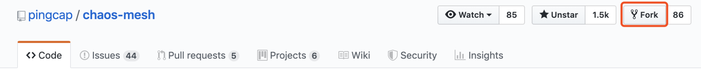
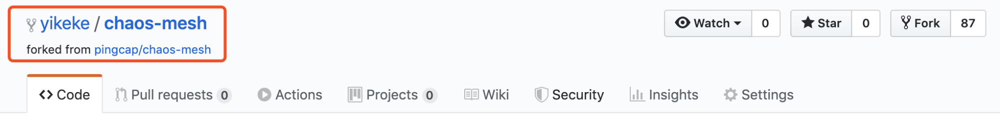

## Fork 与 Clone

当我们准备开始为 Chaos-mesh 做出代码贡献时，第一件我们需要做的事情就是将 Chaos-mesh 仓库 fork 并 clone 到本地。

本文以 chaos-mesh 项目为例，介绍使用 [Git](https://git-scm.com/downloads) 提交贡献的流程和常见问题。

> 注意：
> 
> 在进入以下操作之前，首先确保你已经[安装](https://git-scm.com/downloads)并在终端配置好了 Git。

### 第一步：Fork 想要提交贡献的仓库

1. 进入目标仓库 https://github.com/pingcap/chaos-mesh，在页面右上角，点击 Fork 按钮，该操作会复制一份 pingcap/chaos-mesh 仓库的副本到你的 Github 账户。




2. Fork 成功后，你会进入自己的 fork 仓库页面



### 第二步，将仓库 clone 到本地

将你 fork 的 chaos-mesh 仓库 clone 到本地，在终端里执行以下命令（注意将 <> 内容整块替换）：

```bash
export working_dir=<你放置本地仓库的自定义目录>
export user=<你的 Github ID>
mkdir -p $working_dir
cd $working_dir
git clone https://github.com/$user/chaos-mesh.git
```

clone 过程可能会持续几分钟。clone 成功后，你的工作目录内会出现 chaos-mesh 文件夹，里面是你的 fork 仓库的全部内容。

当本地仓库 clone 完毕以后，我们需要将本地仓库设置一个上游源，从而帮助我们在以后本地仓库同步上游仓库。

``` bash
# 添加上游仓库
cd $working_dir/chaos-mesh
git remote add upstream https://github.com/pingcap/chaos-mesh.git
```

### 第三步，新建本地工作 branch

首先确保本地 master branch 与上游 master 保持最新。

```bash
cd $working_dir/chaos-mesh
git fetch upstream
git checkout master
git rebase upstream/master
```

基于 master branch 新建一个工作 branch：

```bash
git checkout -b new-branch-name
```
	
上面的 git checkout 操作会让你进入 new-branch-name 这个 branch。

## 第四步：编辑文档进行增删或修改

进入你的工作 branch 后，你就可以使用编辑器（如 Visual Studio Code）打开本地 chaos-mesh 仓库，对相应代码文件进行修改了。

### 第五步：提交你的修改

将你的修改提交到你的 branch 上：

```bash
git status # 查看修改的文件
git add <修改的文件路径>  # 如果你想提交所有的文件修改，可使用 `git add .`
git commit 
```

git commit 命令会调用 vim 编辑器让你输入 commit message（必填），你需要在 message 里简要说明这次提交的改动，方便 review。建议你遵循 [TiDB 社区 commit message 规范](https://github.com/pingcap/community/blob/master/contributors/commit-message-pr-style.md#how-to-write-a-good-commit-message)：

```bash
<改动的文件夹/子系统>: <做了什么改动>
<空一行>
<为什么做这写改动>
<空一行>
```

确保你的 branch 仍与上游 master 保持同步：

```bash
git fetch upstream
git rebase upstream/master
```

### 第六步: 推送改动

当你的改动完成以后，你需要将你本地的 branch 推送到远程的个人账户下的 chaos-mesh 仓库。

```bash
git fetch upstream
git rebase upstream/master
```
