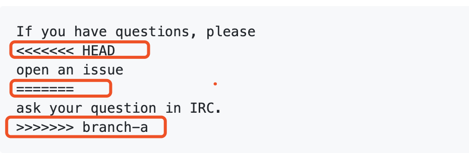
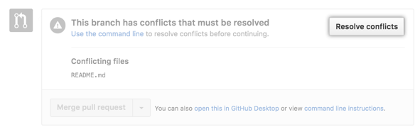
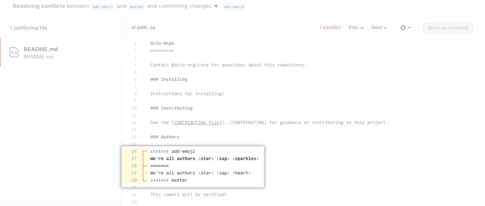
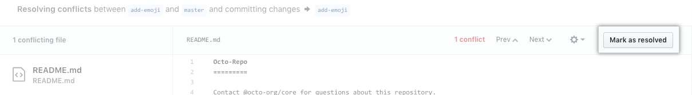
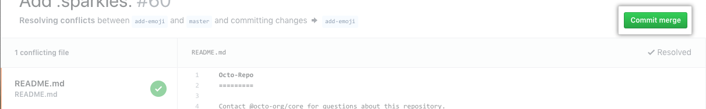

## 常见 git 使用场景

在进行本地开发时，我们会不时地遇到一些版本管理问题需要我们通过使用 git 来解决。这里我们总结了一些常见场景来帮助你快速解决问题。


### 同步上游 master 分支

在日常操作中，有时候会发生在我们还在本地分支开发工作时，上游仓库的 master 分支已经领先本地分支的情况。如果我们希望本地分支可以同步上游 master 分支的改动的话，可以通过以下操作:

```bash
# 切换至目标 branch
git checkout master

# 从上游 master 获取最新 HEAD
git fetch upstream master 
# 强制将当前 branch 与上游 master 同步
git reset --hard upstream/master

# 将该 branch 强制推至 remote
git push -f origin master

```

### 重置本地/远程 master 分支

在我们的开发流程中，本地与远程仓库的 master 分支都是用来同步上游的 master 分支，并且作为 base 分支给我们的新建分支来使用。当本地或者远程仓库与上游仓库的 master 分支不同步时，或者是我们误提交了内容到本地、远程仓库的 master 分支时，我们可以通过重置本地与远程仓库的 master，来保持和上游仓库 master 分支的同步。

```bash
# 切换到 master 分支
git checkout master

# 下拉上游仓库的 master 分支
git pull upstream master

# 将本地仓库的 master 分支重置回上游仓库 master 分支
git reset --hard upstream/master

# 将远程仓库的 master 分支重置回上游仓库 master 分支
git push origin master --force
```

### 解决 merge 冲突

在某些场景下，你的本地改动可能会和上游 master 分支产生冲突。冲突会留下如下所示的冲突印记：



* <<<<<<< HEAD 后是 HEAD 或基本分支的更改内容。 
* 接下来是 =======，它将 HEAD 的更改与你的分支的更改分隔开。
* 最后跟着 >>>>>>> BRANCH-NAME。 

遇到这种情况，则代表了你需要解决冲突。解决冲突时，你需要决定你要保持哪个分支的更改，或者进行全新的更改（可能包含两个分支的更改）。 最后，必须要删除冲突标记 <<<<<<<, =======, >>>>>>>。

解决冲突有 Pull Request 页面直接解决 以及 Git 命令行 两种方式。

#### Pull Request 页面解决冲突

1. 在 PR 页面底部，如果下图所示的 Resolve conflicts 按钮是可以点击的： 



2. 则可以直接点击按钮解决冲突：



3. 解决完单个文件里存在的冲突后，点击页面上方的 Mark as resolved:



4. 如果多个文件存在冲突，全部解决完成后点击 Commit merge:



#### 通过 Git 解决冲突

1.  导航到有合并冲突的本地 chaos-mesh 仓库中:

```bash
cd $working_dir/chaos-mesh
```

2. 使用 git status 查看受合并冲突影响的文件列表:

```bash
git status
```
比如文件 styleguide.md 存在合并冲突，则预期输出类似于:

```bash
> # On branch branch-b
> # You have unmerged paths.
> #   (fix conflicts and run "git commit")
> #
> # Unmerged paths:
> #   (use "git add ..." to mark resolution)
> #
> # both modified:      styleguide.md
> #
> no changes added to commit (use "git add" and/or "git commit -a")
```

3. 打开您首选的文本编辑器，导航到有合并冲突的文件。解决完所有冲突后，按正常 git add -> git commit -> git push 流程将更改 push 到远程。
