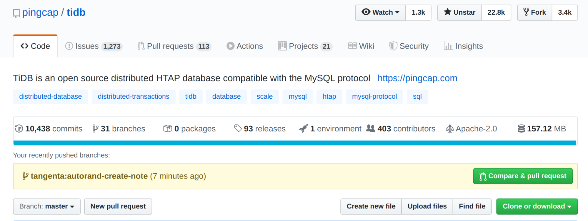
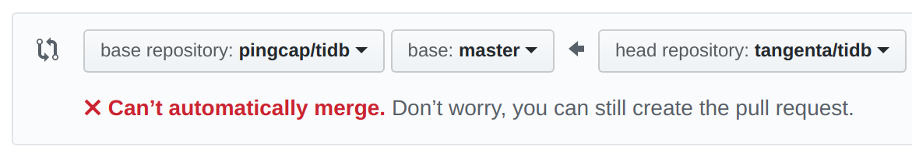
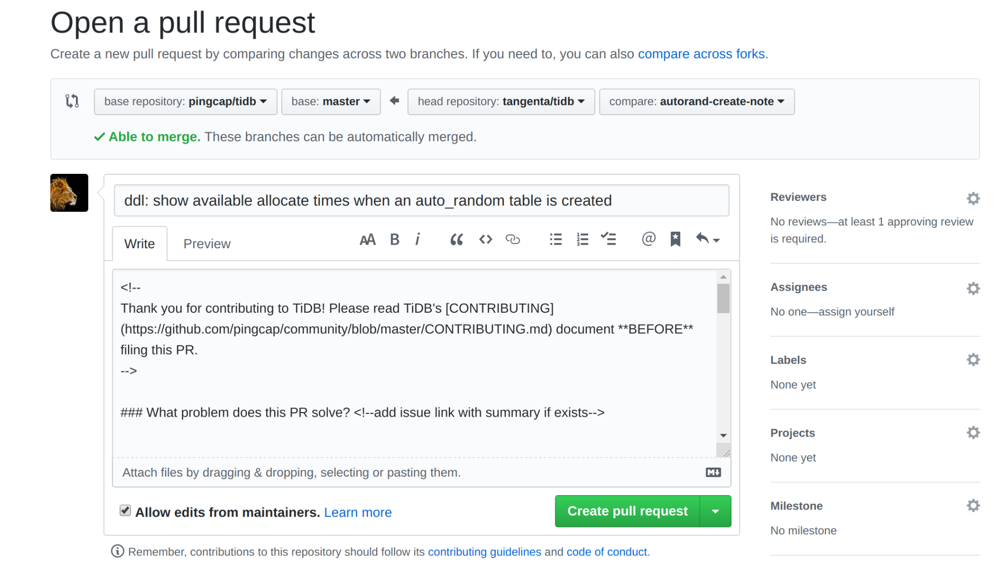
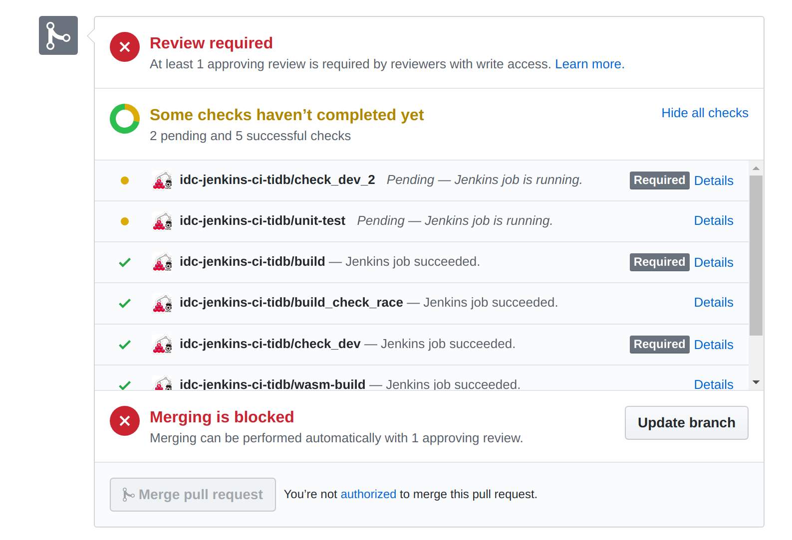
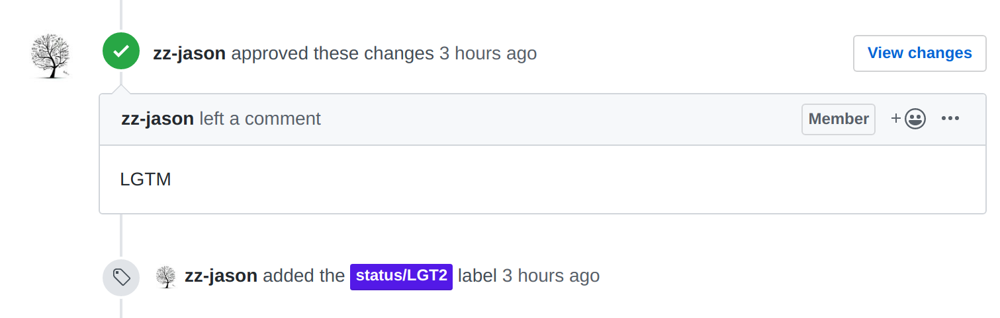
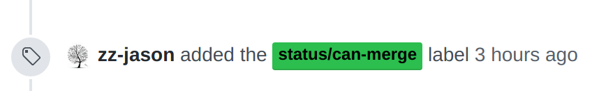

## 提交 Pull Request

当我们完成本地开发并将改动推送到了远程仓库中时，我们可以使用 Github Pull Request 功能来将改动推送到上游仓库的 master 分支。我们可以到远程仓库的 GitHub 页面，点击右边绿色的 “Compare & pull request”，会跳转到 pull request 的创建页面：

如果需要合并的分支在远程上游仓库和自己的仓库之间没有冲突，会显示 Able to merge，说明可以开始填写 pull request 的 description 了。但如果出现下图的情况，则说明自己当前的分支不是基于上游仓库的目标分支开发的，或者上游分支已更新。对于后者，可以根据上文提到的同步上游 master 分支，并把自己的修改 rebase 到最新的版本上，此时再次打开 pull request 页面，会显示 “Able to merge”。

pull request 的标题格式可以参考当前已经 merged 的 pull request，因仓库不同而异。以 TiDB 为例，TiDB 仓库的 pull request 标题格式为 “[修改模块的名称]: 修改内容”。标题内容应当尽可能简洁、明确。

接下来是填写 pull request 的 description。我们只需要根据模板中的指示，逐个回答模板中的几个问题即可，如果有额外的补充，也可以写到 description 合适的位置中。

填写完 description 以后，建议再次在下方的 diff 中查看自己的代码更改，确认无误后点击 Create pull request，即可完成 pull request 的创建。这时可以耐心等待仓库的持续集成测试，如下所示：

## Merge Pull Request

每一个 pull request 要能够被合入主干分支，原则上必须满足以下几个条件:

1. 所有的 checks 都通过
2. 当前更改基于最新的分支
3. 获得 reviewer 两个或以上的 LGTM（Look Good To Me，表示 reviewer 同意合并）和一个 approved。

当 reviewer 给出 LGTM 之后，通常会给 PR 打上一个 label，例如：

并且最后 approved 的人会标记 can-merge：

当通过了 pull request 中的所有检查，并且得到了足够数量的 revier 认可以后，对应项目的 maintainer 则会自动将 pull request 合并进主 master 分支。此时，则恭喜你成为 PingCAP 的贡献者。