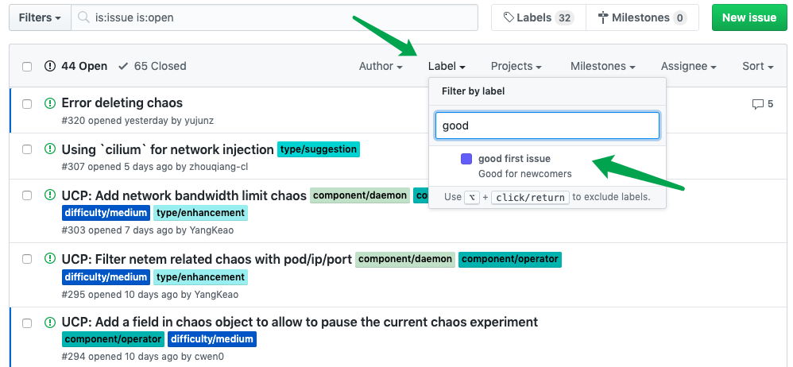
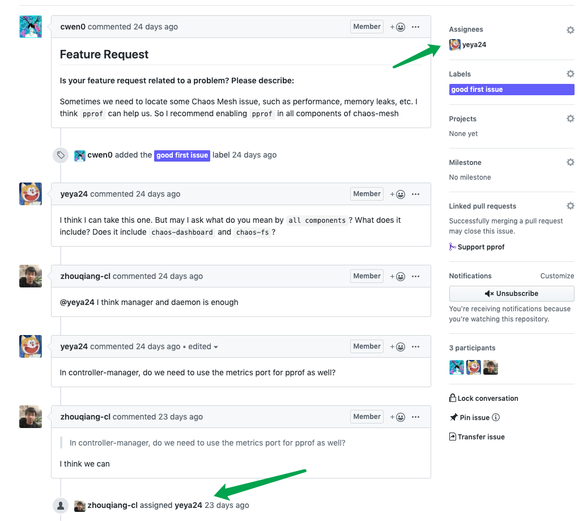

## 成为 Contributor 的第一步

想要成为一名 Contributor， 如何挑选一个合适自己的入门 Issue 非常重要。对于已经非常有经验的 Contributor 来说，可能在 Issue 页面中看一眼就能找到适合自己的 Issue 来做贡献。对于第一次给目标仓库来提出代码贡献的新手来说，我们推荐从较为简单的 Issue 开始入手。

### Good First Issue

通常来讲，PingCAP 下的各个仓库，Maintainer 在创建 Issue 时都会将一些适合初学者以及刚刚入门的 Issue 表为 `good first issue` 这个标签。 这类的  Issue 通常难度较为简单，可能拥有一些比较简单的前置知识就能轻松搞定。我们可以在 PingCAP 下的仓库中，通过 Label 标签选择器来筛选出。 对于某些 PingCAP 下的仓库，在 Label 中搜索 easy 关键字也可以搜索出适合初学者的 Issue.

### 认领 Issue

当我们找到合适的 good first Issue 后，我们首先需要确认这个 Issue 目前是否是待认领状态。如果我们找到的 good first issue 已经被其他人率先认领了，那么非常遗憾，我们只能再去寻找下一个目标。确认的方法非常简单，只需要点进 Issue 详情页面以后查看 Assignees 栏下是由已经有其他人认领了。假如 Assignees 是空的 ，那么我们可以直接在这个 Issue 详情页中，与 Maintainer 进行交流并申请认领这个 Issue 。 在认领的过程中，我们也可以向 Maintainer 确认该 Issue 的详情细节。

在这里我们以一个真实的认领过程作为例子，展示认领 Issue 的完整流程。我们可以看到，Contributor 在 Issue 中通过 “I think I can take this one” 向 Maintainer 表示自己可以认领这个 Issue，并且针对具体细节做了提问。当细节技术问题确认完毕以后，Maintainer 会通过 assign 将这个 Issue 指派给你。 届时，你就可以放心大胆的开始代码贡献之旅。

