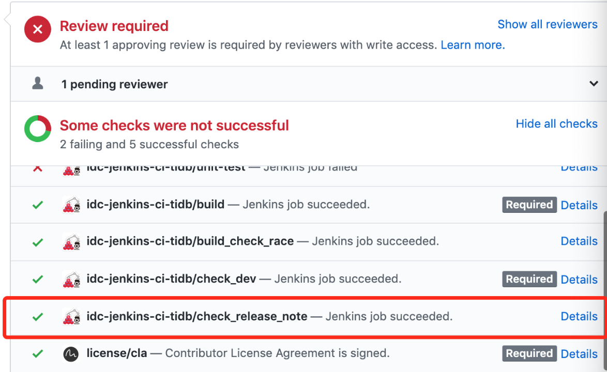
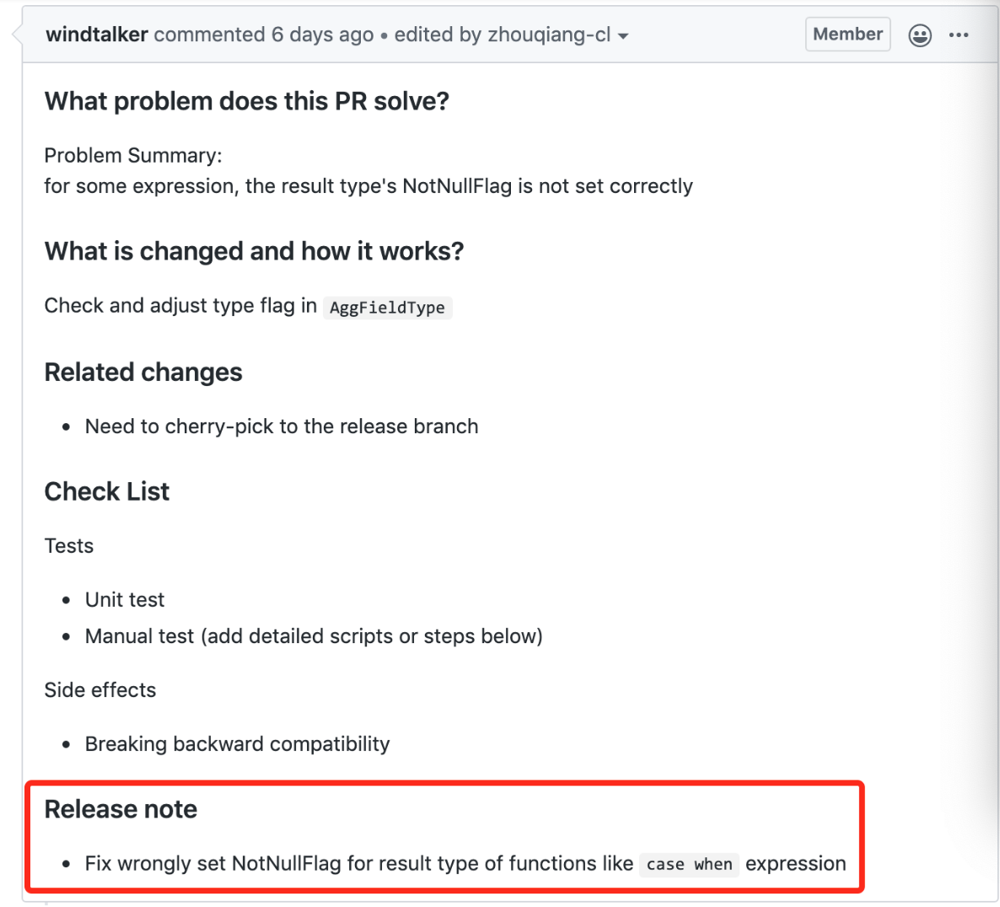
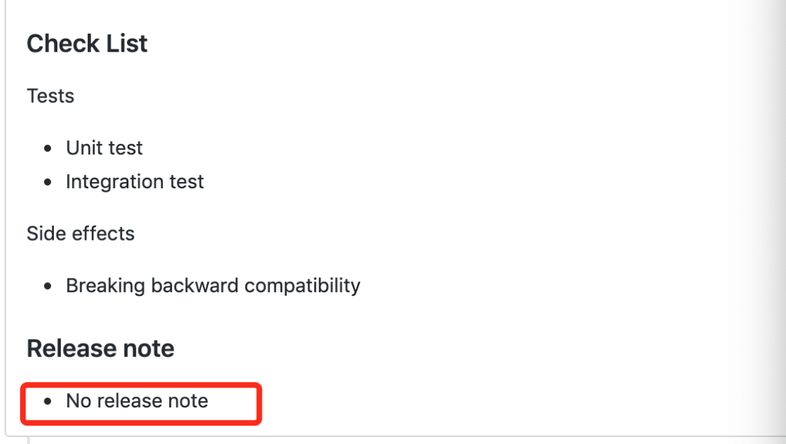

# Release Note Checker

This document describes the background, principle, and usage method of the release note checker.

## Background
As we all know, the release process of TiDB is relatively lengthy. One of the most time-consuming thing is collecting release notes. We have many PRs that do not have a release note when they are merged. Therefore, a release note checker has been added to some repositories in the CI Check. Please pay attention when you mention or review a PR. The effect is as follows:

## Check principle and usage
CI obtains the Release note keyword from the description, and judges that there is a release note displayed in the form of a list (internal judgment is a regular expression `Release note[\r\n]\s*[-|*].+`). If there is, it will judge success.

If there is really no release note, you can write "No release note"

## Trigger method
At present, every commit will automatically run a check. If the description is modified and you want to trigger again, you can command the `/rebuild` command to trigger again
