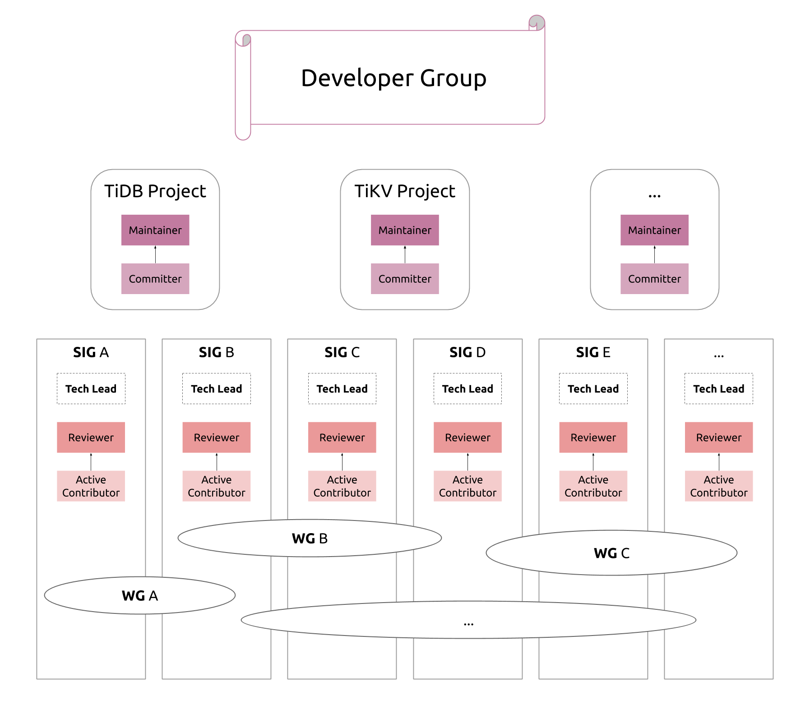

# Working Group Governance

<!-- vim-markdown-toc GFM -->

* [What is Working Group (WG)?](#what-is-working-group-wg)
* [Relationship between WG and SIG](#relationship-between-wg-and-sig)
* [WG Lifecycle](#wg-lifecycle)
  * [Create](#create)
  * [Dismiss](#dismiss)

<!-- vim-markdown-toc -->

## What is Working Group (WG)?

Contributors are totally able to just work on goals together without it being a Working Group (WG) or formal team. A WG is a formal recognition that these kinds of groups will form, and that WGs can empower and enhance these cooperations.

A Working Group usually solves a problem that spans the scope of responsibility of multiple Special Interest Groups (SIGs), so it usually consists of members from different SIGs or some other community contributors. The Working Group usually dissolves after the problem is solved. For more detailed procedures of creating or dismiss, see [WG Lifecycle](#wg-lifecycle).

The Working Group has the following characteristics: 

* Does not own the code
* Have formal hierarchy or expected outcomes
* Is a short-term organization and will be disbanded after the goal or mission is completed
* Typically addresses a concern affecting multiple SIGs or subprojects

## Relationship between WG and SIG

The assets owned by the TiDB Project (eg: code, documentation, blogs, regulations, etc.) are owned and managed by SIGs, maintainers, and ultimately our PMC. However, there are assets that are specially owned and managed by Working Groups, such as:

* Calendar events
* Slack channel
* Event Progress Report

Working Groups have different goals with those of SIGs. A WG aims to:

* Promote collaboration between different SIGs
* Resolve some specific problems with a minimal organization

## WG Lifecycle

### Creation

* Before creating a working group, make sure you get the following ready:
  * Ensure all WG Organizers, and other leadership roles are community members
  * Have the answers to following questions:
    * What is the exact problem this group is trying to solve?
    * What is the artifact that this group will deliver, and to whom?
    * How does the group know when the problem-solving process is completed, and it is time for the Working Group to dissolve?
    * Who are all of the stakeholder SIGs involved in this problem this group is trying to solve? Have you
    * What are the meeting mechanics (frequency, duration, roles)?
* Once you have met the above criteria, you can submit a Pull Request titled "WG-Creation-Request: WG-XXX", with all the items and related documents (RFCs, PRs) attached. The PR will be reviewed by the PMC. 2 approvals are required for the PR to pass.

1. Create a `wg-${name}.md` file in [working group directory](../working-groups) (modify `${name}` to your Working Group short name) according to [Working Group template](../working-groups/wg-template.md), and modify the **Active Working Groups** list in the [Working Groups](../working-groups/README.md) page
2. Submit a Pull Request on [pingcap/community](https://github.com/pingcap/community), which is determined by voting by the Maintainer/PMC. The Working Group will be announced after the Pull Request is merged.
3. Create a channel corresponding to the Working Group on [Slack: tidbcommunity.slack.com](tidbcommunity.slack.com).

### Dissolution

* The Working Group can dissolve itself after it feels that the mission it set out to do is complete.
* If the working group has met one of the following requirements, the working group may be dissolved by the PMC:
  * None of the communication channels for the Working Group have been in use for the goals outlined at the founding of the Working Group in 2 months:
    * Slack channel
    * Zoom meeting room