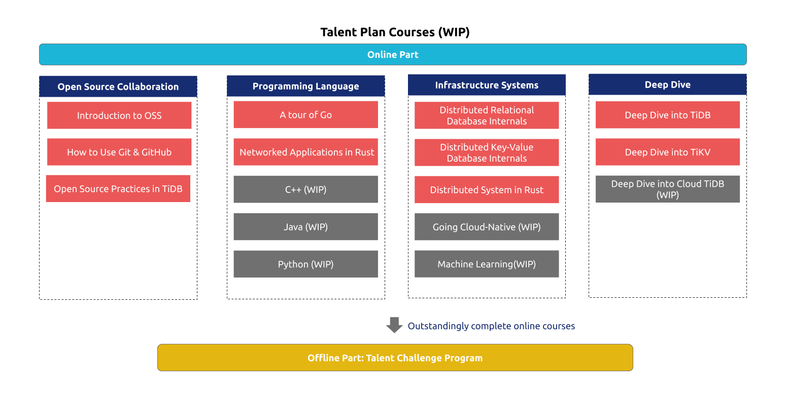

# Proposal: Talent Plan Courses

- Author(s): [Ling Jin](https://github.com/JinLingChristoher)
- Last updated: 2020-01-13
- Discussion at: [Incubating Program: Talent Plan Courses](https://github.com/pingcap/community/issues/130)

## Background

Talent Plan is a study project developed by PingCAP for training and/or evaluating students, new employees, and new contributors to [TiDB] and [TiKV]. At the moment, only two study roadmaps are provided. This proposal provides Talent Plan Courses, a new version of the study project with more enriched topics and course designs.

[TiDB]: https://github.com/pingcap/tidb
[TiKV]: https://github.com/tikv/tikv

## Course Framework

The picture above shows the latest framework of Talent Plan Courses. In addition to TiDB related learning materials, lots of other sections are provided as well. Following are the details:

- Open Source Cooperation

  Open source spirit is one of the cores of the TiDB Community.  At current, multiple courses regarding this subject are on the list:

  - Introduction to OSS
    A fundamental course about open source and its history

  - How to use Git&Github
    Git is a free and open source distributed version control system designed to handle everything from small to very large projects with speed and efficiency. Github is a popular website based on Git where people around the world collaborate in open source projects. After taking this course, participants should know the usages of Git and Github.

  - Open Source Practice in TiDB
    TiDB ecosystem is made up of multiple open-source projects on Github. For people who want to contribute to TiDB, open-source practice in TiDB would be helpful for them.

- Programming Language

 To contribute to the code base of an open-source project,  knowing the programming language is a basic requirement. We provide the related programming language courses to help participant learns quickly:

  - Golang
    The Go programming language is heavily used in the industry, and also in the TiDB ecosystem. If you haven't learned about it, the following are good places to start:

  - [A Tour Of Golang](https://tour.golang.org/) is recommanded since it's a great official tutorial for the newbie to learn the basic language features.
  - [The Go Programming Language](http://www.gopl.io/) is recommended as a reference book for people want to learn the language in detail.
  - [Talent Plan MapReduce](https://github.com/pingcap/talent-plan/tree/master/tidb/mapreduce) will be a great tool for participants to judge their learning outcomes.

  - Rust
    The Rust programming language is becoming more and more popular since it has many advanced features. For people interested in TiKV which is based on rust, we recommend the following materials:

  - [Learn Rust](https://www.rust-lang.org/learn) is official study materials, it contains a book, an interactive practice assignment, and some code examples. We believe anyone interested in the Rust programming language can benefit from it.
  - [Practical Networked Application in Rust](https://github.com/pingcap/talent-plan/tree/master/rust) is a programming assignment framework develop by [Brian Anderson](https://github.com/brson), who was a core team member of the rust community. We strongly suggest taking this assignment to consolidate rust programming skills.

  Other programming languages like C++, Java, Python also in the works, as the development of this course system, more concrete contents will be appended.

- Infrastructure System

  - Distributed Relational Database Internals is a course made up of many reading materials and programming assignments. A broad range of topics such as relational algebra, parser, runtime, optimizer, transaction, DDL and more are covered in readings. TinySQL is a simplified version of TiDB, used as the programming assignment framework, which let participants can verify their learning outcomes.
  - Distributed Key-Value Database Internals is a course about distributed key-value database systems. The reading materials cover storage engine, data partitioning, replication, consistency, scalability, balance, distributed transactions and more. For programming assignment, TinyKV, a simplified version of TiKV, will be provided to course participants to verify their learning outcomes.

   Topics such as cloud-native database systems and Machine Learning are also planned.

- Deep Dive Series Readings

  For anyone who wants to get to know more about TiDB related projects, they would benefit a lot by reading Deep Dive series articles, including into TiDB and Deep Dive into TiKV. It's worth mentioning that Deep Dive into Cloud TiDB is also in development. We highly recommend reading these materials to help you get familiar with the inner world of the TiDB ecosystem.

Course participants can choose their own learning path based on personal conditions and learning goals. There will be more topics and courses to be proposed in the future.

## Rationale

There are many open study resources online, we can gather those materials together to make the learning path easier. Furthermore, the courses will be practice-oriented, elaborately designed programming assignments as the core, which can help participants to check their learning outcomes.

## Compatibility

N/A

## Implementation

The implementation of the course requires the following 3 main steps:

- Discuss the overview course framework of the new version.
- Make agreements of the syllabus for each course
- Fill in learning materials and assignments.
- Optimize assignment submission and evaluation.

## Open issues (if applicable)
