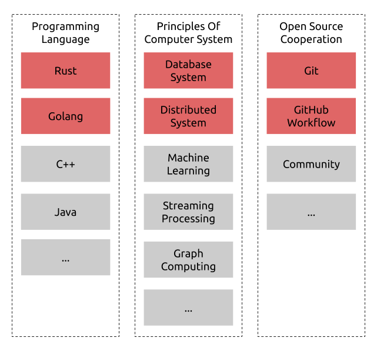

# Proposal: Talent Plan Courses

- Author(s): [Ling Jin](https://github.com/JinLingChristoher)
- Last updated: 2019-12-11
- Discussion at: [Incubating Program: Talent Plan Courses](https://github.com/pingcap/community/issues/130)

There are plenty of people interested in TiDB but lacking background knowledge, so we propose to create a series of courses to help those people enter the field infrastructure systems and TiDB ecosystem. Course participants should have developed good knowledge and skills in system programming after finishing course materials.

## Course design

The above is the design of the course system. This series of courses include but not limited to the principles of computer system design, the programming language to be used, open-source cooperation, and more. The development of a distributed database system course is in progress, and more courses will be created in the future.

## Rationale

There are many open study resources online, our courses can borrow ideas from world-class universities and from MOOCs as well. The courses will be practice-concentrate, with well-designed programming assignments as the core. Reading materials including slides, notes is also irreplaceable.

## Compatibility

N/A

## Implementation

To implement it, we need the following main steps:

- Discuss the subject to be included in the course system.
- Divide the subject topics, and assign them to course developers.
- Create the programming assignment framework and the corresponding reading materials.

## Open issues (if applicable)
