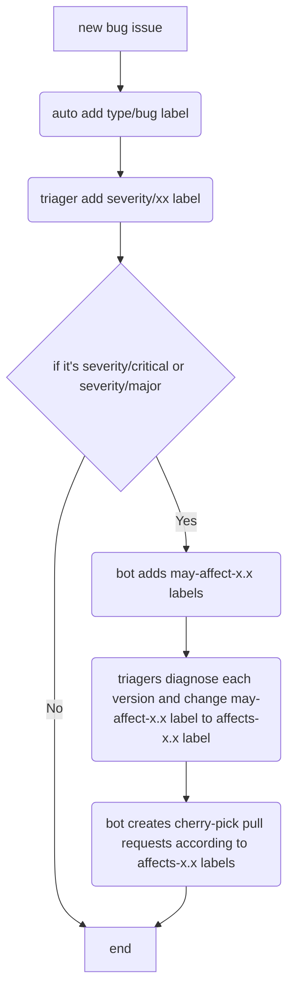
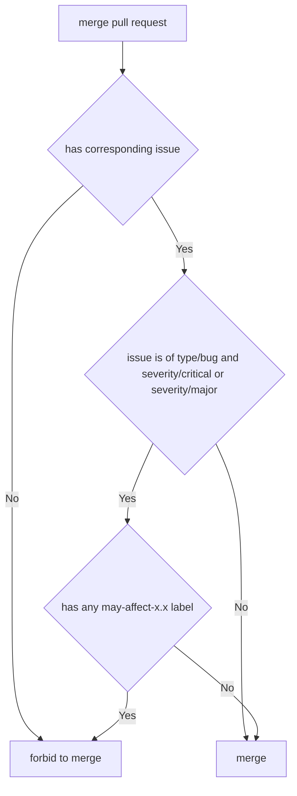

# New Triage Process for Cherrypick

Authors: @ichn-hu @Mini256 @zhangyangyu

## Motivation

According to the [release model](https://pingcap.github.io/tidb-dev-guide/project-management/release-train-model.html), TiDB is going to have multiple releases. Each release matches one git branch. For `type/bug` issues with `severity/critical` and `severity/major`, creators and reviewers are responsible to diagnose which versions the issue affects. For affected versions, they add the corresponding `affects-x.x` labels to the issue. The ti-srebot will create cherry-pick pull requests according to the labels.

This model still have a drawback that it is not able to identify whether all the affected versions are diagnosed, that say the `affects-x.x` label list is complete or not. For example, if an issue miss a `affects-5.1` label, we don't know it's been diagnosed but identified as not affected or it's just the creator or reviewer forget to add the label. So a critical or major bug might miss some versions due to mistake, especially when there are more and more versions. To solve the problem and prevent overlooked versions, we'd like to propose a new triage workflow.

## Solution

The triage workflow still only applies to critical and major bugfix issues. For such issues, when they are created, the ti-chi-bot will assign a list of `may-affect-x.x` labels to the issue. For example, currently we have version 5.0, 5.1, 5.2, 5.3, 4.0 and the in-sprint 5.4, when a `type/bug` issue is created and added label `severity/critical` or `severity/major`, the ti-chi-bot will add label `may-affect-4.0`, `may-affect-5.0`, `may-affect-5.1`, `may-affect-5.2`, and `may-affect-5.4`. These labels mean that the creator and reviewer need to check whether the issue affects such versions. When a version is diagnosed, the triager needs to remove the corresponding `may-affect-x.x` label. If the version is affected, he/she needs to add the corresponding `affects-x.x` label to the issue in the meanwhile, otherwise not. So when a issue has a label `may-affect-x.x`, this means the issue has not been diagnosed on version x.x. When a issue has a label `affects-x.x`, this means the issue has been diagnosed on version x.x and identified affected. When both the two labels are missing, this means the issue has been diagnosed on version x.x but the version is not affected.

| may-affect-x.x | affects-x.x |                         status                                |
|:--------------:|:-----------:|:-------------------------------------------------------------:|
|     YES        |    NO       | version x.x has not been diagnosed                            |
|     NO         |    NO       | version x.x has been diagnosed and identified as not affected |
|     NO         |    YES      | version x.x has been diagnosed and identified as affected     |
|     YES        |    YES      | invalid status                                                |

In such a workflow, we can assure all the effected versions could be correctly diagnosed. 

The ti-srebot still creates cherry-pick pull requests according to the `affects-x.x` labels. But when a pull request is going to merge, the bot will check whether the [corresponding issue](https://pingcap.github.io/tidb-dev-guide/contribute-to-tidb/contribute-code.html#referring-to-an-issue) has any `may-affect-x.x` label, which means the issue has not been diagnosed on all needed versions. If there is, the pull request is blocked and not able to be merged. So in order to merge a bugfix pull request into master branch, every other effective version needs to first be diagnosed.

The final workflow is:

## Affected Repositories

* tidb
* ticdc
* tidb-tools
* tidb-binlog
* ng-monitoring

## Deadline

The vote will be open for at least 144 hours unless there is an objection or not enough votes.

We're looking for at least 2 votes from tidb-maintainers, and 2 votes from migration-maintainers.
